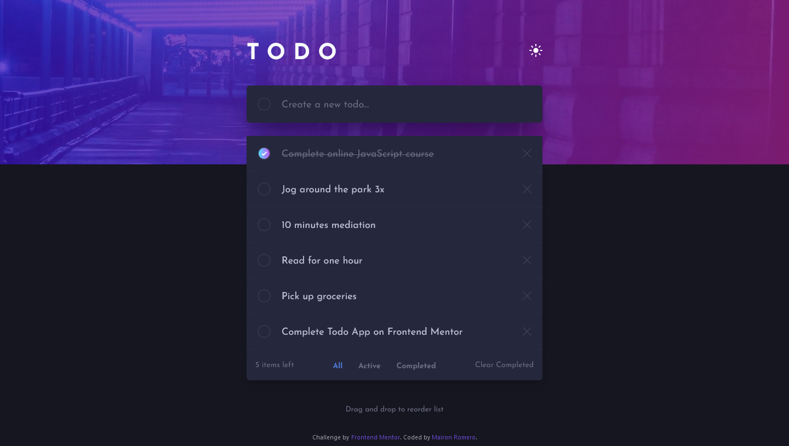

# Frontend Mentor - Todo app solution

This is a solution to the [Todo app challenge on Frontend Mentor](https://www.frontendmentor.io/challenges/todo-app-Su1_KokOW).

## Table of contents

- [Overview](#overview)
  - [The challenge](#the-challenge)
  - [Screenshot](#screenshot)
  - [Links](#links)
- [My process](#my-process)
  - [Built with](#built-with)
  - [What I learned](#what-i-learned)
  - [Continued development](#continued-development)
  - [Useful resources](#useful-resources)
- [Author](#author)

## Overview

This project started as a normal crud challenge, but I decided to make it a bit more complex, so I create a custom API Rest with Node Express, MongoDB and Mongoose, to add some features like access token, and refresh token (cookie) authentication, roles authorization, and persistent sessions without the use of local or session storage.

In the future i want to add a recovery password feature, and user profile.

### The challenge

Users should be able to:

- View the optimal layout for the app depending on their device's screen size
- See hover states for all interactive elements on the page
- Add new todos to the list
- Mark todos as complete
- Delete todos from the list
- Filter by all/active/complete todos
- Clear all completed todos
- Toggle light and dark mode
- **Bonus**: Drag and drop to reorder items on the list

### Screenshot

### Links

- Solution URL: [Go to Front-end Mentor solution](https://www.frontendmentor.io/solutions/todo-app-with-reacttypescript-and-tailwind-JHU_EOz6o)
- Live Site URL: [Go to live example](https://todo-ml.netlify.app/)

## My process

### Built with

- Semantic HTML5 markup
- CSS custom properties
- Flexbox
- CSS Grid
- Mobile-first workflow
- [TypeScript](https://www.typescriptlang.org/)
- [React](https://reactjs.org/) - JS library
- [Tailwind](https://tailwindcss.com/) - For styles
- [Netlify](https://www.netlify.com/) - Deployment

### What I learned

I learned the use of the react-beautiful-dnd to make every row a droppable element

### Continued development

I want to keep improving my React skills, before jumping into Next.js

### Useful resources

- [Tailwind Docs](https://tailwindcss.com/docs/configuration)
- [react-beautiful-dnd](https://www.youtube.com/watch?v=bZsMWorjtFI&t=932s)
- [useReducer-and-Context-With-Typescript](https://dev.to/elisealcala/react-context-with-usereducer-and-typescript-4obm)

## Author

- Website - [Mairon Romero](https://mairon-romero.netlify.app/)
- Frontend Mentor - [@MaironL](https://www.frontendmentor.io/profile/MaironL)
- linkedin - [Mairon Romero](https://www.linkedin.com/in/maironromero)

## Acknowledgments

- Yoelvis Mules { code }[Youtube-Channel](https://www.youtube.com/channel/UCp28AG2NaDuzyVaAT--2NGQ)
